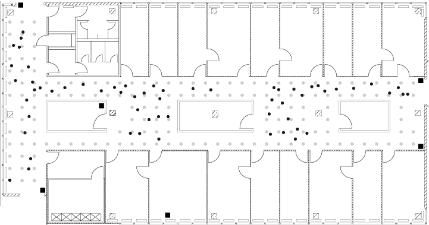

# Business Understanding

Organizations measure productivity in various ways depending upon the metrics they want to track. They may look at shipping times for materials, optimization of workflows within the organization, and any are focused on cost minimization. One such way organizations can help within this optimization is through leveraging real-time location systems (RTLS). Real-time location systems allow organizations to monitory assess and workers through the workflows that exist within the organization. 

The evaluation of RTLS as is relates to an organizations WiFi usage is one such method to analyze productivity. More specifically, the distribution of various wifi-enabled RTLS devices across a facility may allow clustering methods to be leveraged in order to predict the position of assets based on previous patterns. In this particular evaluation data were provided for offline and online data across 6 access points. The building layout, access point configuration, online measurements (black dots), and offline measurements (gray dots) are shown below in Figure 1.



The objectives for this case study are:

* evaluate the data to determine the optimal access point configuration to include in the data
* evaluate both a regular unweighted KNN and weighted KNN methodology to perform predictions


# Data Engineering

In evaluating the data that has been made available it is critical to understand the data file structure. There are two data files to work with: Online.txt and Offline.txt. The Offline.txt file contains information relating to the offline measurements that were taken. The Online.txt file contains information relating to the online measurements that were taken. The Offline.txt file makes up the training data set while the Online.txt file is the test data set. Both files are structured with the data fields noted below:

Data Field | Data Description
-----------|-----------------
   t       | Time stamp in milliseconds
   Id      | Router MAC Address
   Pos     | Router Location (Comma separated positions for x, y, z)
   Degree  | Direction scanning device measured in degrees that was carried by the researcher
   MAC     | MAC address of either the router, or scanning device combined with corresponding values for signal strength (dBm), the mode in which it was operating(adhoc scanner = 1, access router = 3), and its corresponding channel frequency.
   Signal  | Received Signal Strength in DbM
   
   
As noted above, the data fields have compressed information into single columns. For example, the Pos column contains information for X,Y, and Z coordinates in comma delimited format instead of being broken out into individual fields. The same is true for the MAC column. The MAC column contains information on the router MAC address, signal strength, operating mode and channel. In order to handle all of this information data frames were constructed for both the online and offline data sets. Each field was split out into a column within the data frame in order to make analysis much easier. 

In reviewing the data in raw form a few observations were identified:

 * The Z position (i.e. elevation) was zero for the data points. This indicates a column that can be dropped for the specific analysis.
 * The scan angles are not consistent and need to be made consistent. Plan to round these to the nearest 45 degree angle,
 * There are some MAC addresses with only a few data points. A threshold of approximately 1 million will be set. Any MAC addresses with less than this threshold will be removed
 
In specific relation to this analysis the following features will also be dropped from the dataframe as they do not impact the analysis:

 * scanMac - this is the MAC address of the scanner
 * channel - this is the channel the data was read on
 * type - this is the device type
 
Multiple columns will be created to assist in further analysis
 
 * medSignal - this will be the median signal strength captured
 * avgSignal - this will be the average signal strength captured
 * sdSignal - this will be the standard deviation of the captured signal strength
 * iqrSignal - this is the interquartile range of the captured signal strength
 * posXY - this is a combintion of the posX, posY fields into a single value. Coordinates are separated by the '-' character
 * rawTime - this is a raw time value

For purposes of these analysis these rules were applied to both the online and offline data sets. 

```{r,echo=FALSE}
# Define the MAC IDs of the relevant routers/access points
fileLoc = "C:\\RAI\\DS7333-QTW\\CaseStudy1\\Data\\offline.final.trace.txt"
fileLoc2 = "C:\\RAI\\DS7333-QTW\\CaseStudy1\\Data\\online.final.trace.txt"
macsC0 = c('00:0f:a3:39:e1:c0', '00:14:bf:b1:97:90', '00:14:bf:3b:c7:c6','00:14:bf:b1:97:81', '00:14:bf:b1:97:8a', '00:14:bf:b1:97:8d') #C0
macsCD = c('00:0f:a3:39:dd:cd', '00:14:bf:b1:97:90', '00:14:bf:3b:c7:c6','00:14:bf:b1:97:81', '00:14:bf:b1:97:8a', '00:14:bf:b1:97:8d') #CD
macsC0_CD = c('00:0f:a3:39:e1:c0', '00:0f:a3:39:dd:cd', '00:14:bf:b1:97:90','00:14:bf:3b:c7:c6', '00:14:bf:b1:97:8a', '00:14:bf:b1:97:8d') # C0 & CD
cols01 = c("posXY", "posX","posY", "orientation", "angle") 
cols02 = c("posXY", "posX","posY")
cols03 = "signal"
cols04 = c("posX", "posY")
cols05 = "avgSignal"
cols06 = c("time", "scanMac","posX", "posY", "posZ", "orientation","mac", "signal", "channel", "type")
cols07 = c("scanMac", "posZ", "channel", "type")
cols08 = c("time", "posX", "posY", "orientation", "signal")
cols09 = c("POSIXt", "POSIXct")
cols10 = c("posXY", "posX","posY", "orientation", "angle")
commentValue = "[;=,]"
commentValue2 = "#"
sepValue = "-"
accessPoint = "3"
seed = 125

# This takes all of the above and makes a function that combines all of it
processLine = function(x)
{ tokens = strsplit(x, commentValue)[[1]]
  if (length(tokens) == 10) return(NULL)
  tmp = matrix(tokens[ - (1:10) ], ncol= 4, byrow = TRUE)
  cbind(matrix(tokens[c(2, 4, 6:8, 10)], nrow(tmp), 6,
               byrow = TRUE), tmp)}

roundOrientation = function(angles) {
  refs = seq(0, by = 45, length  = 9)
  q = sapply(angles, function(o) which.min(abs(o - refs)))
  c(refs[1:8], 0)[q]}

readData =
  function(filename, macs )
  {txt = readLines(filename)
    lines = txt[ substr(txt, 1, 1) != commentValue2 ]
    tmp = lapply(lines, processLine)
    offline = as.data.frame(do.call("rbind", tmp),
                            stringsAsFactors= FALSE)
    names(offline) = cols06
    offline = offline[ offline$type == accessPoint, ]
    dropVars = cols07
    offline = offline[ , !( names(offline) %in% dropVars ) ]
    offline = offline[ offline$mac %in% macs, ]
    numVars = cols08
    offline[ numVars ] = lapply(offline[ numVars ], as.numeric)
    offline$rawTime = offline$time
    offline$time = offline$time/1000
    class(offline$time) = cols09
    # round orientations to nearest 45
    offline$angle = roundOrientation(offline$orientation)
    return(offline)}

# With C0 without CD
offline <- readData(filename = fileLoc , macs=macsC0)   # Change file location
offline$posXY = paste(offline$posX, offline$posY, sep = sepValue)

byLocAngleAP = with(offline, by(offline, list(posXY, angle, mac),function(x) x))

signalSummary = 
  lapply(byLocAngleAP, 
         function(oneLoc) { 
           ans = oneLoc[1,] 
           ans$medSignal = median(oneLoc$signal) 
           ans$avgSignal = mean(oneLoc$signal) 
           ans$num = length(oneLoc$signal)
           ans$sdSignal = sd(oneLoc$signal)
           ans$iqrSignal = IQR(oneLoc$signal)
           ans
         })
offlineSummary = do.call("rbind", signalSummary)

# With CD without C0
offline2 <- readData(filename = fileLoc , macs=macsCD)  # Change file location
offline2$posXY = paste(offline2$posX, offline2$posY, sep = sepValue)

byLocAngleAP2 = with(offline2, by(offline2, list(posXY, angle, mac), function(x) x))

signalSummary2 = 
  lapply(byLocAngleAP2, 
         function(oneLoc) { 
           ans = oneLoc[1,] 
           ans$medSignal = median(oneLoc$signal) 
           ans$avgSignal = mean(oneLoc$signal) 
           ans$num = length(oneLoc$signal)
           ans$sdSignal = sd(oneLoc$signal)
           ans$iqrSignal = IQR(oneLoc$signal)
           ans
         })
offlineSummary2 = do.call("rbind", signalSummary2)

# With C0 and CD
offlineall <- readData(filename = fileLoc , macs=macsC0_CD)   # Change file location
offlineall$posXY = paste(offlineall$posX, offlineall$posY, sep = sepValue)

byLocAngleAPall = with(offlineall, by(offlineall, list(posXY, angle, mac),function(x) x))

signalSummaryall = 
  lapply(byLocAngleAPall, 
         function(oneLoc) { 
           ans = oneLoc[1,] 
           ans$medSignal = median(oneLoc$signal) 
           ans$avgSignal = mean(oneLoc$signal) 
           ans$num = length(oneLoc$signal)
           ans$sdSignal = sd(oneLoc$signal)
           ans$iqrSignal = IQR(oneLoc$signal)
           ans
         })
offlineSummaryall = do.call("rbind", signalSummaryall)

# With C0 without CD
online <- readData(filename = fileLoc2, macs=macsC0)  
online$posXY = paste(online$posX, online$posY, sep = sepValue)

Loc = with(online, by(online, list(posXY), function(x) { 
  ans = x[1, cols01] 
  avgSS = tapply(x$signal, x$mac, mean) 
  y = matrix(avgSS, nrow = 1, ncol = 6, dimnames = list(ans$posXY, names(avgSS))) 
  cbind(ans, y) }))
onlineSummary = do.call("rbind", Loc)

# With CD without C0
online2 <- readData(filename = fileLoc2, macs=macsCD)  
online2$posXY = paste(online2$posX, online2$posY, sep = sepValue)

Loc = with(online2, by(online2, list(posXY), function(x) {
  ans = x[1, cols01] 
  avgSS = tapply(x$signal, x$mac, mean) 
  y = matrix(avgSS, nrow = 1, ncol = 6, 
             dimnames = list(ans$posXY, names(avgSS))) 
  cbind(ans, y) }))
onlineSummary2 = do.call("rbind", Loc)

# With both CD and C0
onlineall <- readData(filename = fileLoc2, macs=macsC0_CD)  
onlineall$posXY = paste(onlineall$posX, onlineall$posY, sep = sepValue)

Loc = with(onlineall, by(onlineall, list(posXY), function(x) {
  ans = x[1, cols01] 
  avgSS = tapply(x$signal, x$mac, mean) 
  y = matrix(avgSS, nrow = 1, ncol = 6, 
             dimnames = list(ans$posXY, names(avgSS))) 
  cbind(ans, y) }))
onlineSummaryAll = do.call("rbind", Loc)
```

As part of the analysis the determination of certain access points to keep or remove was needed. Specifically evaluation of whether to individually keep both access points that ended in C0 and CD or to keep only one of these points. This need resulted in three distinct dataframes for each file as follows:

Data Frame | Description
-----------|------------
offlineSummary    | The offline dataframe containing only the C0 access point
offlineSummary2   | The offline dataframe containing only the CD access point
offlineSummaryall | The offline dataframe containing both C0 and CD
onlineSummary     | The online dataframe containing only the C0 access point
onlineSummary2    | The online dataframe containing only the CD access point
offlineSummaryall | The online dataframe containing both C0 and CD

All of the dataframes have the same structure. For illustrative purposes a view of the offlineSummaryall dataframe showing the available features is below:

```{r}
summary.default(offlineSummaryall)
```

In preparation for data modeling, the data has also been flattened to create a dataframe with a single positional entry (X, Y coordinate) for each MAC address. This will help to reduce the analysis record count down to approximately 1328 points per MAC address. this breakdown is shown below:


```{r}
head(offlineSummaryall)

aggregate(cbind(count = mac) ~ mac, 
          data = offlineSummaryall, 
          FUN = function(x){NROW(x)})
```
Building the dataframes as described above with flattened data and dataframes containing the different access points allows for providing quick analysis of the data. 

# Access Point Analysis

One of the analysis points that must be determined is whether to use the MAC address ending with C0 only, the MAC address ending in CD only, or to keep both in our data set. In order to determine which approach to take, the KNN methodolody will be executed on all three configurations. Using this information it can be determined which configuration will be used. The elbow plots shown below will assist in this determination
```{r,echo=FALSE}
## K-Nearest Neighbors Analysis

### Angle orientation adjustments before KNN
adjustData = function(data, varSignal = cols03, cols = cols02) {
  set01 = with(data, by(data, list(posXY), function(x) {
  ans = x[1, cols]
  avgSS = tapply(x[ , varSignal ], x$mac, mean)
  y = matrix(avgSS, nrow = 1, ncol = 6,
  dimnames = list(ans$posXY,names(avgSS)))
  cbind(ans, y)}))
  adjustDataRes = do.call("rbind", set01)
return(adjustDataRes)}

### Angle orientation adjustments before KNN - odd and evens
adjustAngle = function(adjustAngleData, signals = NULL, m = 1){
  refs = seq(0, by = 45, length  = 8)
  roundedAngle = roundOrientation(adjustAngleData)
  
  if (m %% 2 == 1) angles = seq(-45 * (m - 1) /2, 45 * (m - 1) /2, length = m)
  else {m = m + 1
    angles = seq(-45 * (m - 1) /2, 45 * (m - 1) /2, length = m)
    if (sign(adjustAngleData - roundedAngle) > -1) 
      angles = angles[ -1 ]
    else 
      angles = angles[ -m ]}
  angles = angles + roundedAngle
  angles[angles < 0] = angles[ angles < 0 ] + 360
  angles[angles > 360] = angles[ angles > 360 ] - 360
  angles = sort(angles)
  offlineSubset = signals[ signals$angle %in% angles, ]
  adjustData(offlineSubset, varSignal = cols05)}

### Neighbor location
locKNNpoints = function(signalData, trainSubset) { 
  diffs = apply(trainSubset[, 4:9], 1, function(x) x - signalData) 
  dists = apply(diffs, 2, function(x) sqrt(sum(x^2))) 
  closest = order(dists) 
  return(trainSubset[closest, 1:3])}

### Location prediction
knnPredict = function(signalData, newAngles, trainData,numAngles = 1, k = 3){closeXY = list(length = nrow(signalData))
  for (i in 1:nrow(signalData)) {
    trainSS = adjustAngle(newAngles[i], trainData, m = numAngles)
    closeXY[[i]] = locKNNpoints(signalData = as.numeric(signalData[i, ]), trainSS)}
    estXY = lapply(closeXY,function(x) sapply(x[ ,2:3],function(x) mean(x[1:k])))
    estXY = do.call("rbind", estXY)
  return(estXY)}
```
``` {r, echo=FALSE}

#Original Code with hard coded K's
### C0 KNN Scoring
onlineLocs_C0 = onlineSummary[ , cols04]
### K = 1 - baseline
predLocs1 = knnPredict(signalData = onlineSummary[ , 6:11], newAngles = onlineSummary[ , 4], offlineSummary, numAngles = 3, k = 1)
C0error1 = function(predLocs1, onlineLocs_C0) sum(rowSums((predLocs1 - onlineLocs_C0)^2)) 
sapply(list(predLocs1), C0error1, onlineLocs_C0)
### K = 3
predLocs3 = knnPredict(signalData = onlineSummary[ , 6:11], newAngles = onlineSummary[ , 4], offlineSummary, numAngles = 3, k = 3)
C0error3 = function(predLocs3, onlineLocs_C0) sum(rowSums((predLocs3 - onlineLocs_C0)^2)) 
sapply(list(predLocs3), C0error3, onlineLocs_C0)
### K = 5
predLocs5 = knnPredict(signalData = onlineSummary[ , 6:11], newAngles = onlineSummary[ , 4], offlineSummary, numAngles = 3, k = 5)
C0error5 = function(predLocs5, onlineLocs_C0) sum(rowSums((predLocs5 - onlineLocs_C0)^2)) 
sapply(list(predLocs5), C0error5, onlineLocs_C0)
### K = 7
predLocs7 = knnPredict(signalData = onlineSummary[ , 6:11], newAngles = onlineSummary[ , 4], offlineSummary, numAngles = 3, k = 7)
C0error7 = function(predLocs7, onlineLocs_C0) sum(rowSums((predLocs7 - onlineLocs_C0)^2)) 
sapply(list(predLocs7), C0error7, onlineLocs_C0)
### K = 10
predLocs10 = knnPredict(signalData = onlineSummary[ , 6:11], newAngles = onlineSummary[ , 4], offlineSummary, numAngles = 3, k = 10)
C0error10 = function(predLocs10, onlineLocs_C0) sum(rowSums((predLocs10 - onlineLocs_C0)^2)) 
sapply(list(predLocs10), C0error10, onlineLocs_C0)
# Optimal K = 7 for C0 - 273.6

### CD KNN Scoring
onlineLocs_CD = onlineSummary2[ , cols04]
### K = 1 - baseline
predLocsCD_1 = knnPredict(signalData = onlineSummary2[ , 6:11], newAngles = onlineSummary2[ , 4], offlineSummary2, numAngles = 3, k = 1)
CDerror2_1 = function(predLocsCD_1, onlineLocs_CD) sum(rowSums((predLocsCD_1 - onlineLocs_CD)^2))
sapply(list(predLocsCD_1), CDerror2_1, onlineLocs_CD)
### K = 3
predLocsCD_3 = knnPredict(signalData = onlineSummary2[ , 6:11], newAngles = onlineSummary2[ , 4], offlineSummary2, numAngles = 3, k = 3)
CDerror2_3 = function(predLocsCD_3, onlineLocs_CD) sum(rowSums((predLocsCD_3 - onlineLocs_CD)^2))
sapply(list(predLocsCD_3), CDerror2_3, onlineLocs_CD)
### K = 5
predLocsCD_5 = knnPredict(signalData = onlineSummary2[ , 6:11], newAngles = onlineSummary2[ , 4], offlineSummary2, numAngles = 3, k = 5)
CDerror2_5 = function(predLocsCD_5, onlineLocs_CD) sum(rowSums((predLocsCD_5 - onlineLocs_CD)^2))
sapply(list(predLocsCD_5), CDerror2_5, onlineLocs_CD)
### K = 7
predLocsCD_7 = knnPredict(signalData = onlineSummary2[ , 6:11], newAngles = onlineSummary2[ , 4], offlineSummary2, numAngles = 3, k = 7)
CDerror2_7 = function(predLocsCD_7, onlineLocs_CD) sum(rowSums((predLocsCD_7 - onlineLocs_CD)^2))
sapply(list(predLocsCD_7), CDerror2_7, onlineLocs_CD)
### K = 10
predLocsCD_10 = knnPredict(signalData = onlineSummary2[ , 6:11], newAngles = onlineSummary2[ , 4], offlineSummary2, numAngles = 3, k = 10)
CDerror2_10 = function(predLocsCD_10, onlineLocs_CD) sum(rowSums((predLocsCD_10 - onlineLocs_CD)^2))
sapply(list(predLocsCD_10), CDerror2_10, onlineLocs_CD)
### Optimal K = 5 for CD - 249.9
```

```{r,echo=FALSE}
### C0 KNN Scoring - BC
onlineLocs_C0 = onlineSummary[ , cols04]
wss_C0 <- (nrow(onlineLocs_C0)-1)*sum(apply(onlineLocs_C0,2,var))


kMax = 15

for (i in 1:kMax){
  predLocs = knnPredict(signalData = onlineSummary[ , 6:11], newAngles = onlineSummary[ , 4], offlineSummary, numAngles = 3, k = i)
  C0error = function(predLocs, onlineLocs_C0) sum(rowSums((predLocs - onlineLocs_C0)^2)) 
  wss_C0[i] = sapply(list(predLocs), C0error, onlineLocs_C0)
}

### CD KNN Scoring - BC
onlineLocs_CD = onlineSummary2[ , cols04]
wss_CD <- (nrow(onlineLocs_CD)-1)*sum(apply(onlineLocs_CD,2,var))


for (i in 1:kMax){
  predLocs = knnPredict(signalData = onlineSummary2[ , 6:11], newAngles = onlineSummary2[ , 4], offlineSummary2, numAngles = 3, k = i)
  CDerror = function(predLocs, onlineLocs_CD) sum(rowSums((predLocs - onlineLocs_CD)^2)) 
  wss_CD[i] = sapply(list(predLocs), CDerror, onlineLocs_CD)
}

### C0 KNN Scoring - BC
onlineLocs_C0CD = onlineSummaryAll[ , cols04]
wss_C0CD <- (nrow(onlineLocs_C0CD)-1)*sum(apply(onlineLocs_C0CD,2,var))


for (i in 1:kMax){
  predLocs = knnPredict(signalData = onlineSummaryAll[ , 6:11], newAngles = onlineSummaryAll[ , 4], offlineSummaryall, numAngles = 3, k = i)
  C0CDerror = function(predLocs, onlineLocs_C0CD) sum(rowSums((predLocs - onlineLocs_C0CD)^2)) 
  wss_C0CD[i] = sapply(list(predLocs), C0CDerror, onlineLocs_C0CD)
}
```

```{r}
# Plot the elbow curves for all three KNN runs to determine the best K
plot(1:kMax, wss_C0, type="b", xlab="Number of Clusters",
     ylab="Within groups sum of squares",main="Elbow Curve for KNN", col="blue",pch="o")
points(1:kMax, wss_CD, col="red", pch="*")
lines(1:kMax, wss_CD, col="red",lty=2)
points(1:kMax, wss_C0CD, col="red", pch="*")
lines(1:kMax, wss_C0CD, col="red",lty=2)
legend("topright",legend=c("C0","CD","COCD"), col=c("blue","red","black"),
                                   pch=c("o","*","+"),lty=c(1,2,3), ncol=1)

```

Viewingig the combined elbow plot above it can be seen that for the CD configuration a k=5 looks to be about the optimal solution. For C0, k=7 looks to be optimal. From the combined graph, it's difficult to tell what the optimal K for COCD should be. Evaluating the plots individually may assist.

```{r}
plot(1:kMax, wss_C0, type="b", xlab="Number of Clusters",
     ylab="Within groups sum of squares",main="Elbow Curve for C0 Only KNN", col="blue",pch="o")

plot(1:kMax, wss_CD, type="b", xlab="Number of Clusters",
     ylab="Within groups sum of squares",main="Elbow Curve for CD Only KNN", col="blue",pch="o")

plot(1:kMax, wss_C0CD, type="b", xlab="Number of Clusters",
     ylab="Within groups sum of squares",main="Elbow Curve for COCD KNN", col="blue",pch="o")
```
Evaluating the individual graphs reaffirms the values for C0 and CD as standalone cases. The combined case gives a k=7 that looks to be optimal. Lets now look at the individual errors at these k values to determine which best meets the analysis needs.

```{r, echo=FALSE}
predLocs7 = knnPredict(signalData = onlineSummary[ , 6:11], newAngles = onlineSummary[ , 4], offlineSummary, numAngles = 3, k = 7)
C0error7 = function(predLocs7, onlineLocs_C0) sum(rowSums((predLocs7 - onlineLocs_C0)^2)) 
COKNNError = sapply(list(predLocs10), C0error7, onlineLocs_C0)

predLocs = knnPredict(signalData = onlineSummary2[ , 6:11], newAngles = onlineSummary2[ , 4], offlineSummary2, numAngles = 3, k = 5)
CDerror = function(predLocs, onlineLocs_CD) sum(rowSums((predLocs - onlineLocs_CD)^2)) 
CDKNNError = sapply(list(predLocs), CDerror, onlineLocs_CD)

predLocs = knnPredict(signalData = onlineSummaryAll[ , 6:11], newAngles = onlineSummaryAll[ , 4], offlineSummaryall, numAngles = 3, k = 7)
C0error = function(predLocs, onlineLocs_C0CD) sum(rowSums((predLocs - onlineLocs_C0CD)^2)) 
COCDKNNError = sapply(list(predLocs), C0error, onlineLocs_C0CD)


```

```{r}
sprintf("CO KNN Error at K=7: %f", COKNNError)
sprintf("CD KNN Error at K=5: %f", CDKNNError)
sprintf("COCD KNN Error at K=7: %f", COCDKNNError)
```
From the above it can be seen that the lowest error is 
   